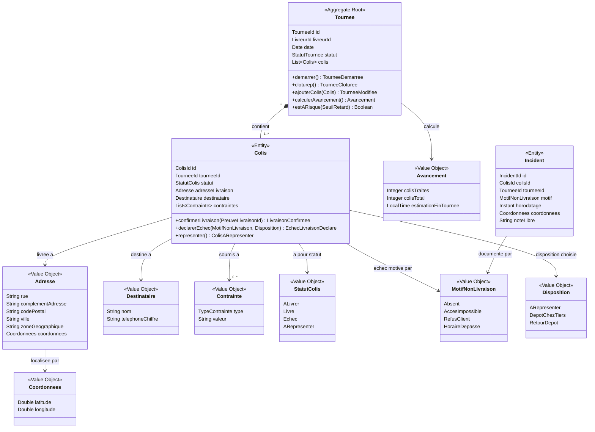
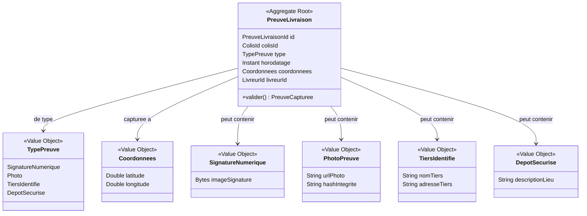
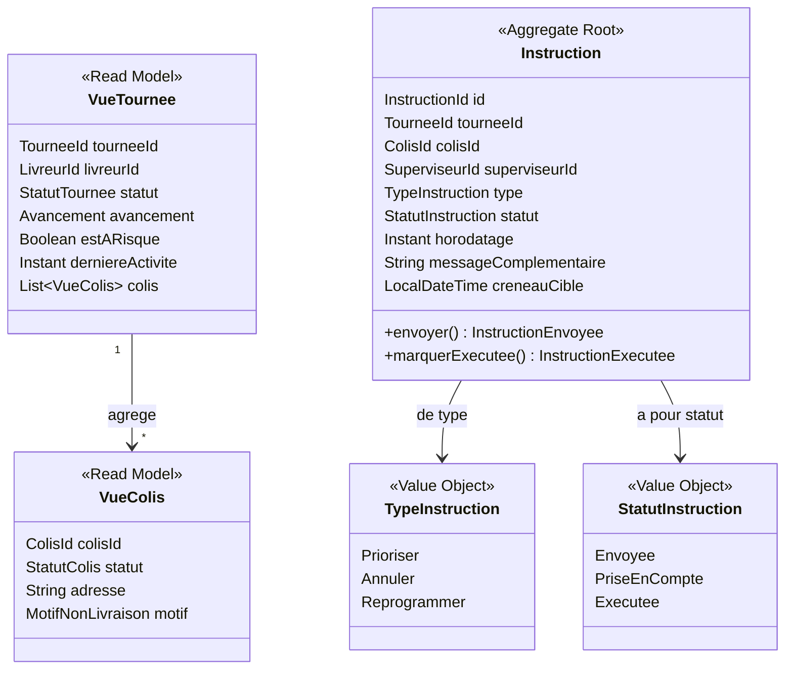

# Domain Model DocuPost

> Document de référence — Version 1.0 — 2026-03-19
> Produit à partir des entretiens métier (Pierre livreur, Mme Dubois DSI, M. Garnier
> Architecte Technique, M. Renaud Responsable Exploitation Logistique), des livrables
> de vision (/livrables/01-vision/) et des livrables UX (/livrables/02-ux/).
>
> Ce document constitue le modèle de domaine de référence pour DocuPost.
> Tout code, test et User Story DOIT utiliser les termes définis ici.
> Les verbatims d'entretiens sont cités entre guillemets pour justifier les choix
> de modélisation.

---

## Ubiquitous Language — Glossaire de référence

> Ces termes sont extraits directement des entretiens terrain. Ils font autorité sur
> tout autre vocabulaire technique ou générique.

| Terme | Bounded Context | Définition métier (verbatim terrain) | Type DDD | Source |
|-------|----------------|--------------------------------------|----------|--------|
| Tournée | Orchestration de Tournée | Ensemble des colis à livrer par un livreur sur une journée, organisé par zone. "Mon seul outil c'est ma feuille de route." (Pierre) | Aggregate Root | Pierre, M. Renaud |
| Colis | Orchestration de Tournée | Unité de livraison avec adresse, contraintes et statut évolutif. Peut être fragile, soumis à un horaire, ou document sensible. | Entity | Pierre |
| Arrêt | Orchestration de Tournée | Point géographique d'une livraison dans la tournée. Un arrêt peut regrouper plusieurs colis pour un même destinataire. | Value Object | Pierre, UX |
| Reste à livrer | Orchestration de Tournée | Nombre de colis non encore traités dans la tournée en cours. Indicateur temps réel. "Je ne sais pas combien il m'en reste." (Pierre) | Calculated Value | Pierre, M. Renaud |
| Statut colis | Orchestration de Tournée | État normalisé d'un colis : à livrer, livré, échec, à représenter. "Chaque colis doit avoir un statut normalisé et horodaté." (M. Garnier) | Value Object | M. Garnier, Pierre |
| Motif de non-livraison | Orchestration de Tournée | Raison normalisée d'un échec : absent, accès impossible, refus client, horaires dépassés. "Chaque livreur a ses propres abréviations." (entretien Pierre) | Value Object | Pierre, M. Renaud |
| Disposition | Orchestration de Tournée | Décision prise sur un colis en échec : à représenter, dépôt chez tiers, retour au dépôt. | Value Object | Pierre, UX |
| À représenter | Orchestration de Tournée | Statut d'un colis dont la livraison a échoué et doit être retenté lors d'une prochaine tournée. | Value Object | Pierre |
| Preuve de livraison | Gestion des Preuves | Élément numérique opposable capturé lors d'une livraison réussie : signature numérique, photo, tiers identifié, dépôt sécurisé. "On a besoin que chaque livraison produise une preuve opposable avec horodatage et géolocalisation." (Mme Dubois) | Entity | Mme Dubois, Pierre |
| Signature numérique | Gestion des Preuves | Capture de la signature du client sur l'écran de l'application mobile. Horodatée et géolocalisée automatiquement. | Value Object | Pierre, Mme Dubois |
| Tiers | Gestion des Preuves | Voisin ou personne identifiée chez qui un colis est déposé en l'absence du destinataire, avec accord documenté. | Value Object | Pierre |
| Dépôt sécurisé | Gestion des Preuves | Lieu de dépôt d'un colis en l'absence du destinataire, documenté et tracé. | Value Object | Pierre |
| Incident | Orchestration de Tournée | Aléa terrain significatif déclaré par le livreur, notifié automatiquement au superviseur. | Entity | Pierre, M. Renaud |
| Instruction | Supervision | Ordre structuré envoyé par le superviseur au livreur via l'application : prioriser, annuler, reprogrammer. "Capacité à envoyer des instructions au livreur." (M. Renaud) | Entity | M. Renaud |
| Tournée à risque | Supervision | Tournée dont l'avancement suggère un dépassement des délais contractuels. "Je voudrais être prévenu avant, pas après." (M. Renaud) | Calculated State | M. Renaud |
| Avancement de tournée | Supervision | Indicateur temps réel du nombre de colis traités par rapport au total. Sert à la détection de tournées à risque. | Calculated Value | M. Renaud |
| Alerte | Supervision | Signal automatique notifiant le superviseur d'une tournée à risque. Doit être détectée en moins de 15 minutes. | Domain Event | M. Renaud |
| Événement de livraison | Intégration SI | Fait métier immuable généré à chaque changement d'état significatif. "Les événements doivent être immutables et historisés." (M. Garnier) | Domain Event | M. Garnier, Mme Dubois |
| Synchronisation OMS | Intégration SI | Transmission d'un événement vers l'OMS via API REST en moins de 30 secondes. "Tout changement de statut colis doit générer un événement synchronisé vers l'OMS." (M. Garnier) | Domain Service | M. Garnier |
| SLA contractuel | Supervision | Engagement de niveau de service sur les délais de livraison des documents sensibles. | Value Object | Mme Dubois |
| Brique SI | Intégration SI | Composant applicatif intégré dans le SI de l'entreprise via API officielle. "L'application livreur doit devenir une brique SI à part entière." (M. Garnier) | Concept architectural | M. Garnier |
| Notification push | Notification | Message envoyé à l'application du livreur depuis le superviseur ou le système pour signaler une instruction ou un ajout. | Domain Event | M. Renaud, Pierre |
| Document sensible | Orchestration de Tournée | Colis contenant des documents nécessitant une preuve d'opposabilité renforcée (engagements contractuels Docaposte). | Value Object (tag) | Mme Dubois |

---

## Bounded Contexts

### BC-01 : Orchestration de Tournée (Core Domain)

**Responsabilité** : Gérer le cycle de vie complet d'une tournée et de chaque colis qui la
compose. C'est le coeur différenciateur de DocuPost : connecter livreur, superviseur et SI
en temps réel avec une logique de statut, d'alerte et d'instruction.

**Classification DDD** : Core Domain. Investissement maximal en modélisation justifié.

**Aggregate Roots** : Tournée, Colis

**Domain Events émis** :
- TournéeChargée, TournéeDémarrée, TournéeModifiée, TournéeClôturée
- LivraisonConfirmée, ÉchecLivraisonDéclaré, MotifEnregistré, DispositionEnregistrée
- IncidentDéclaré, IncidentNotifiéSuperviseur

**Frontières** :
- Entre : référentiel de colis du jour (depuis l'OMS via ACL), identité du livreur
  (depuis BC Identité via Shared Kernel), instructions (depuis BC Supervision)
- Sort : événements de livraison (vers BC Intégration SI), incidents (vers BC Supervision)

---

### BC-02 : Gestion des Preuves (Supporting Subdomain)

**Responsabilité** : Capturer, stocker et rendre disponible les preuves de livraison
numériques opposables. La logique métier est bornée et stable : capture, horodatage,
géolocalisation, typage de la preuve.

**Classification DDD** : Supporting Subdomain. Modèle interne riche mais sans
l'investissement du Core Domain.

**Aggregate Roots** : PreuveLivraison

**Domain Events émis** :
- PreuveCapturée

**Frontières** :
- Entre : décision de livraison (depuis BC Orchestration de Tournée)
- Sort : preuve attachée à l'événement LivraisonConfirmée (vers BC Intégration SI),
  preuve consultable par le support (vers BC Supervision)

---

### BC-03 : Supervision (Supporting Subdomain)

**Responsabilité** : Agréger l'avancement des tournées en temps réel, détecter les
tournées à risque, permettre l'envoi d'instructions structurées aux livreurs.

**Classification DDD** : Supporting Subdomain. Consomme les événements du Core Domain
et les synthétise pour le superviseur.

**Aggregate Roots** : TableauDeBord (agrégat de lecture), Instruction

**Domain Events émis** :
- TournéeÀRisqueDétectée, AlerteDéclenchée
- InstructionEnvoyée, InstructionExécutée

**Domain Events consommés** :
- TournéeDémarrée, LivraisonConfirmée, ÉchecLivraisonDéclaré, IncidentDéclaré,
  TournéeClôturée (depuis BC Orchestration de Tournée)

**Frontières** :
- Entre : événements de tournée (depuis BC Orchestration de Tournée)
- Sort : instructions (vers BC Orchestration de Tournée via BC Notification)

---

### BC-04 : Notification (Supporting Subdomain)

**Responsabilité** : Acheminer les notifications push et les instructions depuis le
superviseur vers le livreur, et les alertes depuis le système vers le superviseur.
Découplage entre l'émetteur et le canal de livraison.

**Classification DDD** : Supporting Subdomain. S'appuie sur des patterns standards
(event-driven, message broker).

**Aggregate Roots** : aucun (service de transit)

**Domain Events émis** :
- InstructionReçue (côté livreur), NotificationEnvoyée

**Frontières** :
- Entre : InstructionEnvoyée (depuis BC Supervision), AlerteDéclenchée (depuis BC
  Supervision)
- Sort : notification push vers l'application mobile livreur

---

### BC-05 : Intégration SI / OMS (Generic Subdomain)

**Responsabilité** : Traduire les événements DocuPost en appels API REST vers l'OMS
externe. Anti-Corruption Layer : protège le modèle interne DocuPost du modèle OMS.
Garantit l'historisation immuable des événements.

**Classification DDD** : Generic Subdomain. Pas de logique métier propre à DocuPost.
Implémenté comme un Adapter standard.

**Aggregate Roots** : aucun (adapter)

**Frontières** :
- Entre : tous les Domain Events significatifs (depuis BC Orchestration de Tournée et
  BC Gestion des Preuves)
- Sort : appels API REST vers l'OMS, store d'événements immuable

---

### BC-06 : Identité et Accès (Generic Subdomain)

**Responsabilité** : Authentification et autorisation des livreurs et superviseurs via
le SSO corporate OAuth2. Aucune logique métier DocuPost.

**Classification DDD** : Generic Subdomain. Solution off-the-shelf imposée par la DSI.

**Frontières** :
- Sort : identité authentifiée (utilisée par tous les autres BC comme Shared Kernel)

---

## Context Map

```
BC_Orchestration_Tournee  --[Customer/Supplier]-->  BC_Supervision
BC_Orchestration_Tournee  --[Customer/Supplier]-->  BC_GestionPreuves
BC_Orchestration_Tournee  --[Published Language / Events]-->  BC_Integration_SI
BC_Supervision             --[Customer/Supplier]-->  BC_Notification
BC_Notification            --[Customer/Supplier]-->  BC_Orchestration_Tournee
BC_Integration_SI          --[ACL]-->  OMS_Externe
BC_Identite_Acces          --[Shared Kernel]-->  BC_Orchestration_Tournee
BC_Identite_Acces          --[Shared Kernel]-->  BC_Supervision
```

| Contexte upstream | Contexte downstream | Type de relation | Mécanisme |
|---|---|---|---|
| BC_Orchestration_Tournee | BC_Supervision | Customer/Supplier (Domain Events) | Event bus interne |
| BC_Orchestration_Tournee | BC_Integration_SI | Published Language | Events + API REST |
| BC_GestionPreuves | BC_Integration_SI | Customer/Supplier | Events |
| BC_Supervision | BC_Notification | Customer/Supplier | Commande InstructionEnvoyée |
| BC_Notification | BC_Orchestration_Tournee | Customer/Supplier | Push notification |
| BC_Integration_SI | OMS Externe | ACL | API REST (sans modification OMS) |
| BC_Identite_Acces | Tous BC | Shared Kernel | Token OAuth2 / SSO |

---

## Modèle de domaine détaillé

### Bounded Context : Orchestration de Tournée



**Invariants de l'agrégat Tournée** :
1. Une Tournée ne peut être démarrée que si elle contient au moins un Colis.
2. Une Tournée ne peut être clôturée que si tous ses Colis ont un statut terminal
   (livré, échec, à représenter) — aucun colis ne doit rester à l'état "à livrer".
3. L'identifiant du livreur est immuable une fois la Tournée démarrée.
4. Un Colis ne peut changer de statut qu'en passant par les transitions autorisées :
   à livrer → livré, à livrer → échec, échec → à représenter.
5. Le motif de non-livraison est obligatoire si le statut du Colis est "échec".
6. La disposition est obligatoire si le statut du Colis est "échec".

**Invariants de l'entité Colis** :
1. Un Colis avec statut "livré" doit être associé à une PreuveLivraisonId.
2. Toute mise à jour de statut génère un événement horodaté et géolocalisé.

---

### Bounded Context : Gestion des Preuves



**Invariants de l'agrégat PreuveLivraison** :
1. Une PreuveLivraison doit contenir exactement une donnée de preuve correspondant
   à son type (signature, photo, tiers ou dépôt).
2. L'horodatage et les coordonnées GPS sont capturés automatiquement au moment de la
   validation. Ils ne peuvent pas être saisis manuellement.
3. Une PreuveLivraison est immuable après création (opposabilité juridique).
4. En l'absence de signal GPS, la livraison peut être confirmée sans coordonnées
   (mode dégradé documenté, signalé comme alerte au superviseur).

Source : "Toute livraison doit produire une preuve opposable (horodatage, géolocalisation,
identité)." (Mme Dubois)

---

### Bounded Context : Supervision



**Invariants de l'agrégat Instruction** :
1. Une Instruction ne peut être envoyée que vers un Colis dont le statut est "à livrer"
   dans une Tournée active.
2. Un Colis ne peut avoir qu'une seule Instruction en attente à la fois.
3. Une Instruction de type "reprogrammer" requiert obligatoirement un créneau cible.
4. Toute Instruction envoyée est historisée avec l'identité du superviseur émetteur.

Source : "Capacité à envoyer des instructions au livreur (prioriser, annuler,
reprogrammer). Statuts et incidents strictement normalisés." (M. Renaud)

---

## Domain Events — Inventaire complet

> Les Domain Events sont des faits passés immuables. Ils représentent ce qui s'est
> passé dans le domaine. Source : "Les événements doivent être immutables et historisés
> (auditabilité)." (M. Garnier)

### BC Orchestration de Tournée

| Événement | Déclencheur | Attributs clés | Consommateurs |
|---|---|---|---|
| TournéeChargée | Livreur ouvre l'application | tourneeId, livreurId, date, nombreColis | BC Supervision |
| TournéeDémarrée | Premier accès à la liste des colis | tourneeId, livreurId, horodatage | BC Supervision, BC Intégration SI |
| LivraisonConfirmée | Livreur confirme la livraison | tourneeId, colisId, preuveLivraisonId, horodatage, coordonnees | BC Gestion des Preuves, BC Intégration SI, BC Supervision |
| ÉchecLivraisonDéclaré | Livreur déclare un échec | tourneeId, colisId, motif, disposition, horodatage, coordonnees | BC Intégration SI, BC Supervision |
| MotifEnregistré | Motif sélectionné lors d'un échec | colisId, motif, horodatage | BC Intégration SI |
| DispositionEnregistrée | Disposition choisie lors d'un échec | colisId, disposition | BC Intégration SI |
| IncidentDéclaré | Aléa terrain signalé | incidentId, colisId, tourneeId, motif, note, horodatage | BC Supervision, BC Intégration SI |
| TournéeModifiée | Instruction reçue et appliquée | tourneeId, instructionId, modification | BC Supervision, BC Intégration SI |
| TournéeClôturée | Livreur clôture sa tournée | tourneeId, livreurId, recap, horodatage | BC Supervision, BC Intégration SI |

### BC Gestion des Preuves

| Événement | Déclencheur | Attributs clés | Consommateurs |
|---|---|---|---|
| PreuveCapturée | Capture numérique finalisée | preuveLivraisonId, colisId, type, horodatage, coordonnees, livreurId | BC Orchestration, BC Intégration SI |

### BC Supervision

| Événement | Déclencheur | Attributs clés | Consommateurs |
|---|---|---|---|
| TournéeÀRisqueDétectée | Écart de délai calculé > seuil | tourneeId, retardEstime, horodatage | BC Notification, tableau de bord |
| AlerteDéclenchée | TournéeÀRisqueDétectée traitée | tourneeId, superviseurId, horodatage | Tableau de bord superviseur |
| InstructionEnvoyée | Superviseur valide une instruction | instructionId, tourneeId, colisId, type, superviseurId, horodatage | BC Notification |
| InstructionExécutée | Livreur a pris en compte l'instruction | instructionId, horodatage | Tableau de bord superviseur |

### BC Notification

| Événement | Déclencheur | Attributs clés | Consommateurs |
|---|---|---|---|
| InstructionReçue | Notification push livrée à l'app mobile | instructionId, livreurId, horodatage | BC Orchestration de Tournée |

---

## Règles métier transversales

> Extraites directement des entretiens et classées par criticité.

### Règles critiques (MVP)

1. **Statut normalisé obligatoire** : "Chaque colis doit avoir un statut normalisé et
   horodaté." (M. Garnier). Aucun colis ne peut rester sans statut terminal à la clôture
   de la tournée.

2. **Preuve opposable obligatoire** : "Toute livraison doit produire une preuve opposable
   (horodatage, géolocalisation, identité)." (Mme Dubois). Toute livraison confirmée
   DOIT être associée à une PreuveLivraison.

3. **Motif normalisé obligatoire** : "Les motifs de non-livraison doivent être structurés
   (absent, accès impossible, refus, horaires)." (Pierre). Aucun champ libre n'est
   autorisé pour le motif principal.

4. **Synchronisation OMS < 30 secondes** : "Tout changement de statut colis doit générer
   un événement synchronisé vers l'OMS." (M. Garnier). SLA technique non négociable.

5. **Événements immuables** : "Les événements de livraison doivent être historisés
   (qui / quoi / quand)." (Mme Dubois). Aucune modification ni suppression d'un événement
   après création.

6. **Offline-first** : "Les zones péri-urbaines ont une connectivité variable." (M. Garnier).
   Toutes les actions terrain doivent être réalisables sans connexion et synchronisées
   au retour du réseau.

### Règles importantes (MVP)

7. **Détection tournée à risque < 15 minutes** : "Je voudrais être prévenu avant, pas
   après." (M. Renaud). La détection automatique doit se déclencher en moins de 15 minutes
   après l'apparition d'un écart de délai significatif.

8. **Preuve disponible < 5 minutes** : "Quand un client nous dit qu'il n'a pas reçu son
   colis, on met parfois des heures à retrouver la preuve." (Mme Dubois). Toute preuve
   doit être accessible par le support client en moins de 5 minutes.

9. **Instruction unique par colis** : Un colis ne peut avoir qu'une seule Instruction
   en attente à la fois pour éviter les conflits d'exécution. (M. Renaud)

10. **Saisie de statut < 45 secondes** : "Mettre à jour le statut d'un colis le plus
    vite possible, sans friction." (Pierre). La séquence complète de mise à jour doit
    être réalisable en moins de 45 secondes.
