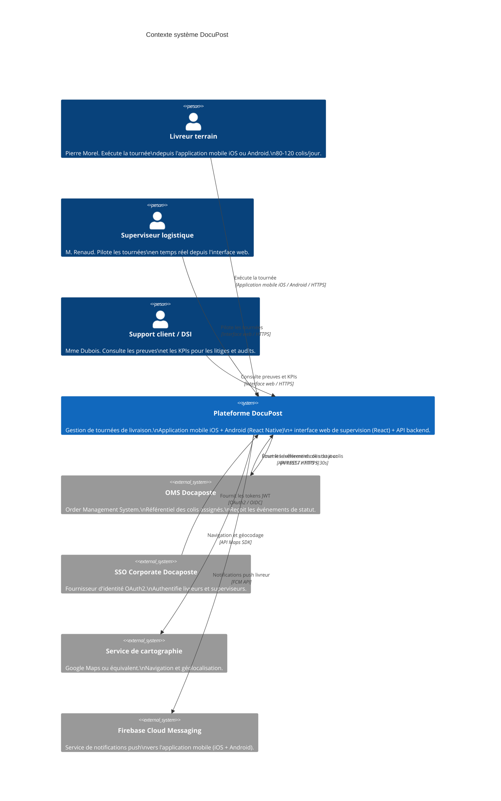

# Architecture Applicative DocuPost

> Document de référence — Version 1.1 — 2026-03-19
> Produit par l'Architecte Technique à partir des entretiens métier (Pierre livreur,
> Mme Dubois DSI, M. Garnier Architecte Technique, M. Renaud Responsable Exploitation
> Logistique), de la vision produit, des livrables UX et de l'architecture métier
> (/livrables/03-architecture-metier/).
>
> Stack imposée par M. Garnier (Architecte Technique DSI) :
> Java 21 / Spring Boot 4.0.3 — React 19 / TypeScript 5.6 — Docker / Kubernetes
> CI/CD GitHub Actions — OAuth2 / SSO corporate — API REST.
>
> Mise à jour v1.1 : abandon de Kotlin + Jetpack Compose au profit de React Native
> (iOS + Android) et d'un monorepo front unifié (React Native + React web).

---

## Vue d'ensemble — Niveau C4 Contexte (Niveau 1)



---

## Vue des Bounded Contexts vers Composants — Niveau C4 Conteneurs (Niveau 2)

```mermaid
C4Container
    title Conteneurs DocuPost (MVP)

    Person(livreur, "Livreur terrain")
    Person(superviseur, "Superviseur / DSI")

    System_Boundary(docupost, "Plateforme DocuPost") {

        Container(mobile, "Application Mobile Livreur", "React Native / TypeScript\n(Expo ou CLI — iOS + Android)",
            "BC-01 Orchestration de Tournée (UI + logique offline)\nBC-02 Gestion des Preuves (capture caméra, signature).\nClient du Backend API.")

        Container(webapp, "Application Web Superviseur", "React 19 / TypeScript 5.6",
            "BC-03 Supervision (tableau de bord, alertes, instructions)\nBC-07 Reporting opérationnel.\nCommunique avec le Backend via REST + WebSocket.")

        Container(api_gateway, "API Gateway / BFF", "Spring Boot 4 / Java 21",
            "Point d'entrée unique. Authentification JWT.\nRouting vers les services backend.\nRate limiting et sécurité périmétrique.")

        Container(svc_tournee, "Service Orchestration Tournée", "Spring Boot 4 / Java 21",
            "BC-01. Core Domain.\nGère Tournée, Colis, Incident.\nPublie les Domain Events.")

        Container(svc_preuves, "Service Gestion des Preuves", "Spring Boot 4 / Java 21",
            "BC-02. Supporting.\nCapture, stocke et expose\nles preuves immuables.")

        Container(svc_supervision, "Service Supervision", "Spring Boot 4 / Java 21",
            "BC-03. Core Domain.\nRead models, détection tournées à risque,\ngestion des Instructions.")

        Container(svc_notification, "Service Notification", "Spring Boot 4 / Java 21",
            "BC-04. Supporting.\nAcheminement push (FCM)\net alertes superviseur (WebSocket).")

        Container(svc_integration, "Service Intégration SI (ACL)", "Spring Boot 4 / Java 21",
            "BC-05. Generic.\nAnti-Corruption Layer OMS.\nEvent store immuable. Rejeu offline.")

        Container(event_bus, "Bus d'événements interne", "Spring ApplicationEventPublisher\n(+ outbox pattern en base)",
            "Transport des Domain Events\nentre les services backend.\nGarantie at-least-once delivery.")

        ContainerDb(db_tournee, "BDD Tournée", "PostgreSQL 16",
            "Agrégats Tournée et Colis.\nÉvénements outbox.")

        ContainerDb(db_preuves, "BDD Preuves", "PostgreSQL 16 + stockage objet S3-compatible",
            "Métadonnées PreuveLivraison.\nFichiers (signatures, photos) en objet store.")

        ContainerDb(db_supervision, "BDD Supervision", "PostgreSQL 16",
            "Read models VueTournee, VueColis.\nInstructions.")

        ContainerDb(db_events, "Event Store immuable", "PostgreSQL 16 (append-only)",
            "Historisation de tous les\nDomain Events (qui/quoi/quand/coordonnées).\nAudit et rejeu OMS.")

        ContainerDb(db_offline, "Stockage local mobile", "WatermelonDB (SQLite)\n(React Native)",
            "Tournée, Colis, Preuves en attente.\nFile de synchronisation offline.")
    }

    System_Ext(oms, "OMS Docaposte", "API REST")
    System_Ext(sso, "SSO Corporate", "OAuth2 / OIDC")
    System_Ext(push_svc, "Firebase Cloud Messaging")

    Rel(livreur, mobile, "Exécute la tournée", "Touch / HTTPS — iOS + Android")
    Rel(superviseur, webapp, "Pilote les tournées", "HTTPS / WS")

    Rel(mobile, api_gateway, "Commandes et queries", "HTTPS / REST + JWT")
    Rel(webapp, api_gateway, "Commandes, queries, temps réel", "HTTPS / REST + WebSocket")

    Rel(api_gateway, svc_tournee, "Routes commandes tournée", "HTTP interne")
    Rel(api_gateway, svc_preuves, "Routes commandes preuves", "HTTP interne")
    Rel(api_gateway, svc_supervision, "Routes queries supervision", "HTTP interne")

    Rel(svc_tournee, db_tournee, "Lecture/écriture agrégats", "JDBC")
    Rel(svc_tournee, event_bus, "Publie Domain Events", "Spring Events + outbox")
    Rel(svc_preuves, db_preuves, "Stocke preuves", "JDBC + S3")
    Rel(svc_supervision, db_supervision, "Lit/écrit read models", "JDBC")
    Rel(svc_integration, db_events, "Append events immuables", "JDBC")
    Rel(svc_integration, oms, "POST statuts colis", "HTTPS / REST")
    Rel(svc_notification, push_svc, "Envoie push iOS + Android", "FCM API")
    Rel(sso, api_gateway, "Valide tokens JWT", "OAuth2 introspection")

    Rel(event_bus, svc_supervision, "Domain Events tournée", "")
    Rel(event_bus, svc_integration, "Domain Events pour OMS", "")
    Rel(event_bus, svc_notification, "InstructionEnvoyée, Alertes", "")

    Rel(mobile, db_offline, "Persistence offline", "WatermelonDB / SQLite")
```

---

## Structure de couches par Bounded Context

### BC-01 — Orchestration de Tournée (Core Domain)

```
svc-orchestration-tournee/
├── domain/
│   ├── model/
│   │   ├── Tournee.java                  # Aggregate Root
│   │   ├── Colis.java                    # Entity
│   │   ├── Incident.java                 # Entity
│   │   ├── Adresse.java                  # Value Object
│   │   ├── Coordonnees.java              # Value Object
│   │   ├── StatutColis.java              # Value Object (enum)
│   │   ├── MotifNonLivraison.java        # Value Object (enum)
│   │   ├── Disposition.java              # Value Object (enum)
│   │   └── Avancement.java              # Value Object (calculé)
│   ├── events/
│   │   ├── TourneeDemarree.java
│   │   ├── LivraisonConfirmee.java
│   │   ├── EchecLivraisonDeclare.java
│   │   ├── IncidentDeclare.java
│   │   ├── TourneeModifiee.java
│   │   └── TourneeCloturee.java
│   ├── repository/
│   │   ├── TourneeRepository.java        # Interface (port)
│   │   └── ColisRepository.java         # Interface (port)
│   └── service/
│       └── AvancementCalculator.java    # Domain Service
├── application/
│   ├── usecase/
│   │   ├── ChargerTourneeUseCase.java
│   │   ├── ConfirmerLivraisonUseCase.java
│   │   ├── DeclarerEchecUseCase.java
│   │   ├── AppliquerInstructionUseCase.java
│   │   └── CloturerTourneeUseCase.java
│   └── port/
│       └── TourneeEventPublisher.java   # Port vers bus
├── infrastructure/
│   ├── persistence/
│   │   ├── TourneeRepositoryImpl.java
│   │   └── TourneeJpaEntity.java
│   ├── messaging/
│   │   └── SpringEventPublisher.java
│   └── offline/
│       └── OutboxPoller.java            # Outbox pattern
└── interface/
    ├── rest/
    │   ├── TourneeController.java
    │   └── ColisController.java
    └── dto/
        ├── TourneeDto.java
        └── ColisStatutUpdateRequest.java
```

### BC-02 — Gestion des Preuves (Supporting Subdomain)

```
svc-gestion-preuves/
├── domain/
│   ├── model/
│   │   ├── PreuveLivraison.java          # Aggregate Root (immuable)
│   │   ├── TypePreuve.java              # Value Object (enum)
│   │   ├── SignatureNumerique.java       # Value Object
│   │   ├── PhotoPreuve.java             # Value Object
│   │   ├── TiersIdentifie.java          # Value Object
│   │   └── DepotSecurise.java           # Value Object
│   ├── events/
│   │   └── PreuveCapturee.java
│   └── repository/
│       └── PreuveLivraisonRepository.java
├── application/
│   └── usecase/
│       └── CapturePreuveUseCase.java
├── infrastructure/
│   ├── persistence/
│   │   └── PreuveLivraisonRepositoryImpl.java
│   └── storage/
│       └── ObjectStoreAdapter.java      # S3-compatible pour fichiers
└── interface/
    ├── rest/
    │   └── PreuveController.java
    └── dto/
        └── CapturePreuveRequest.java
```

### BC-03 — Supervision (Core Domain)

```
svc-supervision/
├── domain/
│   ├── model/
│   │   ├── Instruction.java             # Aggregate Root
│   │   ├── VueTournee.java             # Read Model
│   │   ├── VueColis.java               # Read Model
│   │   ├── TypeInstruction.java        # Value Object (enum)
│   │   └── StatutInstruction.java      # Value Object (enum)
│   ├── events/
│   │   ├── TourneeARisqueDetectee.java
│   │   ├── AlerteDeclenchee.java
│   │   ├── InstructionEnvoyee.java
│   │   └── InstructionExecutee.java
│   ├── repository/
│   │   ├── InstructionRepository.java
│   │   └── VueTourneeRepository.java
│   └── service/
│       └── RisqueDetector.java          # Domain Service : calcul écart délai
│
│   # Extension BC-07 — VueLivreur (US-066) — fusionné dans svc-supervision (MVP)
├── domain/planification/
│   ├── model/
│   │   ├── EtatJournalierLivreur.java  # Value Object (enum) : SANS_TOURNEE | AFFECTE_NON_LANCE | EN_COURS
│   │   └── VueLivreur.java             # Read Model (record immuable) : livreurId, nomComplet, etat, tourneePlanifieeId, codeTms
│   └── service/
│       └── LivreurReferentiel.java     # Interface (port) — implémentation dev : DevLivreurReferentiel (6 livreurs hardcodés)
│                                       # implémentation prod : Bc06LivreurReferentiel (Keycloak BC-06)
│
├── application/
│   ├── usecase/
│   │   └── EnvoyerInstructionUseCase.java
│   ├── handler/
│   │   └── TourneeEventHandler.java     # Consomme events BC-01
│   └── planification/
│       └── ConsulterEtatLivreursHandler.java  # US-066 : dérive EtatJournalierLivreur par livreur depuis TourneePlanifieeRepository
│
├── infrastructure/
│   ├── persistence/
│   │   ├── InstructionRepositoryImpl.java
│   │   └── VueTourneeRepositoryImpl.java
│   ├── dev/
│   │   └── DevLivreurReferentiel.java   # @Profile("dev") — 6 livreurs hardcodés (US-066, US-049)
│   └── websocket/
│       ├── SuperviseurWebSocketPublisher.java
│       └── LivreurEtatWebSocketPublisher.java  # US-066 : écoute AffectationEnregistree, DesaffectationEnregistree,
│                                               #           TourneeLancee, TourneeCloturee → push /topic/livreurs/etat
└── interface/
    ├── rest/
    │   ├── SupervisionController.java
    │   ├── InstructionController.java
    │   └── LivreurEtatController.java   # US-066 : GET /api/supervision/livreurs/etat-du-jour?date={date}
    │                                    #           Accès : ROLE_SUPERVISEUR | ROLE_DSI
    └── dto/
        ├── TableauDeBordDto.java
        ├── InstructionRequest.java
        └── LivreurEtatDTO.java          # US-066 : { livreurId, nomComplet, etat, tourneePlanifieeId, codeTms }
```

### BC-04 — Notification (Supporting Subdomain)

```
svc-notification/
├── application/
│   └── handler/
│       ├── InstructionEnvoyeeHandler.java
│       ├── AlerteDeclencheeHandler.java
│       └── IncidentDeclareHandler.java
└── infrastructure/
    ├── push/
    │   └── FcmPushAdapter.java          # Firebase Cloud Messaging (iOS + Android)
    └── websocket/
        └── AlerteWebSocketPublisher.java
```

### BC-05 — Intégration SI / OMS (Generic Subdomain)

```
svc-integration-si/
├── application/
│   └── handler/
│       ├── LivraisonConfirmeeHandler.java
│       ├── EchecLivraisonHandler.java
│       └── TourneeClotureeHandler.java
├── infrastructure/
│   ├── oms/
│   │   ├── OmsApiAdapter.java           # ACL : appels API REST OMS
│   │   ├── OmsEventTranslator.java      # Mapping DocuPost → OMS
│   │   └── OmsRetryPolicy.java          # Rejeu avec backoff exponentiel
│   └── eventstore/
│       └── EventStoreRepository.java    # Append-only PostgreSQL
└── interface/
    └── (aucune — module consommateur pur)
```

---

## Choix de stack technique — Justifications

### Backend

| Composant | Technologie | Justification |
|---|---|---|
| Language | Java 21 | Imposé par M. Garnier (Architecte DSI). LTS, virtual threads (Project Loom) pour la concurrence. |
| Framework | Spring Boot 4.0.3 | Imposé. Ecosystème mature, Spring Security pour OAuth2, Spring Data JPA, Spring WebSocket. |
| Base de données principale | PostgreSQL 16 | Relationnel fiable, support JSON pour les payloads d'événements, transactions ACID pour l'immuabilité. |
| Event store | PostgreSQL 16 (table append-only) | Simplicité MVP. Pas de Kafka ni d'EventStoreDB au MVP pour limiter la complexité opérationnelle. Évolutif vers Kafka en R2. |
| Outbox pattern | PostgreSQL (table outbox) + scheduler | Garantit la livraison at-least-once des Domain Events même en cas de crash. |
| Stockage fichiers | MinIO (S3-compatible) | Stockage des signatures et photos de preuves. Compatible avec une migration vers S3 AWS ou Azure Blob. |
| API | REST / JSON | Imposé par M. Garnier. Interopérabilité maximale avec l'OMS et les clients mobiles/web. |
| Temps réel superviseur | WebSocket (Spring WebSocket + STOMP) | Mise à jour du tableau de bord < 30 secondes sans polling. |

### Frontend web (Superviseur)

| Composant | Technologie | Justification |
|---|---|---|
| Framework | React 19 + TypeScript 5.6 | Imposé par M. Garnier. Concurrent Mode pour les mises à jour temps réel. |
| State management | Zustand ou React Query | Légèreté vs Redux pour le MVP. React Query pour la synchronisation serveur. |
| WebSocket client | @stomp/stompjs | Compatible Spring WebSocket / STOMP côté serveur. |
| UI | Tailwind CSS + composants Radix UI | Productivité MVP, accessibilité native. |

### Application mobile (Livreur)

| Composant | Technologie | Justification |
|---|---|---|
| Plateforme | iOS (iPhone) + Android (MVP) | React Native permet un support iOS + Android depuis une seule base de code. |
| Framework | React Native / TypeScript (Expo ou CLI) | Voir DD-001. Unification de la stack JS/TS sur l'ensemble du frontend, support iOS + Android, partage de code avec l'app web. |
| UI | React Native Paper ou NativeWind (Tailwind RN) | Cohérence visuelle avec l'app web, composants accessibles et adaptés aux écrans tactiles terrain. |
| Offline | WatermelonDB (SQLite sous-jacent) | Base de données locale réactive pour React Native. Idéale pour les collections de colis et tournées, synchronisation déclarative. Alternative : MMKV (react-native-mmkv) pour les données clé-valeur légères. |
| Sync réseau | Background fetch / react-native-background-fetch | Planification du rejeu des actions offline lorsque la connexion est rétablie. Gestion des contraintes iOS (BGTaskScheduler) et Android (JobScheduler). |
| Push | Firebase Cloud Messaging (FCM) via react-native-firebase | Standard iOS + Android pour les notifications push. |
| Auth | react-native-app-auth (OAuth2 PKCE) | Standard OAuth2 PKCE pour applications mobiles natives, compatible SSO corporate. |
| Caméra/signature | react-native-vision-camera + react-native-signature-canvas | Capture photo et signature numérique cross-platform iOS + Android. |

### Monorepo frontend partagé

| Composant | Technologie | Justification |
|---|---|---|
| Gestionnaire de monorepo | Nx ou Turborepo | Partage de code maximal entre l'app mobile (React Native) et l'app web (React). Pipelines de build parallélisés, cache local et distant. |
| Packages partagés | `@docupost/shared-ui`, `@docupost/domain-hooks`, `@docupost/api-client` | Composants UI adaptables, hooks métier (useConfirmerLivraison, useEtatTournee), client REST typé — consommés par le mobile et le web. |
| Langage unique | TypeScript 5.6 | Cohérence totale du typage entre les packages partagés, l'app web et l'app mobile. |

Voir DD-009 pour la justification détaillée du choix monorepo.

---

## Stratégie offline-first — Application mobile livreur

Contrainte source : "Les zones péri-urbaines ont une connectivité variable." (M. Garnier).
Hypothèse H5 du périmètre MVP : "Définir une stratégie offline-first si les zones
concernées sont significatives."

```
Mode connecté                      Mode offline (zone blanche)
─────────────────                  ────────────────────────────
App → API Gateway                  App → WatermelonDB (local)
      ↓                                  ↓
   Réponse immédiate             Action stockée dans file locale
   + Domain Event publié         Statut affiché "en attente de sync"
                                        ↓
                               Background fetch détecte retour réseau
                                        ↓
                               Rejoue les actions en ordre FIFO
                                        ↓
                               API Gateway reçoit les commandes
                                        ↓
                               Idempotence : chaque commande porte
                               un commandId unique (UUID v7)
                               → rejet silencieux si déjà traitée
```

### Règles offline-first

1. Toutes les commandes terrain (ConfirmerLivraison, DeclarerEchec, CapturePreuve)
   sont exécutables sans connexion réseau.
2. Chaque commande porte un `commandId` UUID v7 unique généré sur le mobile.
   Le backend rejette silencieusement les doublons (idempotence).
3. Les preuves (signatures, photos) sont stockées localement en format compressé
   et uploadées vers l'object store dès le retour de connexion.
4. En mode offline, l'application affiche un indicateur visuel clair ("Synchronisation
   en attente — X actions").
5. La clôture de tournée est bloquée tant que la file de synchronisation n'est pas vide
   et que la connexion n'est pas rétablie.
6. Le SLA de synchronisation OMS (< 30 secondes) s'applique dès le retour de connexion,
   pas depuis l'action terrain.
7. Sur iOS, le background fetch est soumis aux politiques d'exécution différée du système
   (BGTaskScheduler). La synchronisation est garantie dès que l'app repasse au premier plan
   si le background fetch n'a pas encore pu s'exécuter.

---

## Hébergement cloud et environnements

### Infrastructure cible (Kubernetes)

```
┌─────────────────────────────────────────────────────────────────┐
│                    Cluster Kubernetes                           │
│                                                                 │
│  Namespace: docupost-dev    Namespace: docupost-recette         │
│  Namespace: docupost-preprod  Namespace: docupost-prod          │
│                                                                 │
│  Chaque namespace contient :                                    │
│  ┌────────────┐  ┌────────────┐  ┌───────────────────────┐    │
│  │ API Gateway│  │ svc-tournee│  │ svc-preuves           │    │
│  │ (Ingress)  │  │ svc-superv.│  │ svc-notification      │    │
│  │            │  │ svc-integr.│  │ svc-reporting         │    │
│  └────────────┘  └────────────┘  └───────────────────────┘    │
│                                                                 │
│  ┌──────────────────────────────────────────────────────────┐  │
│  │ Données (par namespace)                                  │  │
│  │ PostgreSQL (StatefulSet)    MinIO (StatefulSet)          │  │
│  └──────────────────────────────────────────────────────────┘  │
└─────────────────────────────────────────────────────────────────┘
```

### Environnements (imposés par M. Garnier)

| Environnement | Usage | Données | Accès |
|---|---|---|---|
| dev | Développement continu, tests unitaires et intégration | Données de test synthétiques | Développeurs uniquement |
| recette | Validation fonctionnelle QA, tests E2E | Jeux de données QA anonymisés | QA + PO |
| préprod | Validation de mise en production, tests de charge | Clone anonymisé de la production | Tech lead + DSI |
| prod | Production | Données réelles (RGPD strictement appliqué) | Ops + accès supervisé |

### Déploiement CI/CD (GitHub Actions)

```
Push branche feature → Tests unitaires + lint
                    ↓
PR merged → Build Docker → Push registry
         ↓
         Deploy auto → dev
                    ↓
         Tests E2E automatisés (recette)
                    ↓
         Validation manuelle PO → Deploy recette
                    ↓
         Validation DSI → Deploy préprod
                    ↓
         Validation tech lead → Deploy prod (blue/green)
```

Note : les builds React Native (iOS .ipa / Android .apk) sont intégrés au pipeline CI/CD
via Expo EAS Build ou Fastlane selon la configuration retenue en DD-009.

---

## Feature Broadcast — Architecture applicative

> Section ajoutée en v1.2 — 2026-04-21.
> Source : entretien Karim B. (Superviseur IDF Sud), périmètre-mvp.md §"Feature Broadcast",
> domain-model.md §"BC-03 BroadcastMessage", modules-fonctionnels.md Module 8,
> wireframes.md W-09 et M-08.

---

### Vue d'ensemble du flux Broadcast

```
Superviseur (W-09)
     │
     │ 1. POST /api/supervision/broadcasts  (EnvoyerBroadcast)
     ▼
API Gateway  →  JWT validation (rôle SUPERVISEUR)
     │
     ▼
svc-supervision
  EnvoyerBroadcastUseCase
     │
     │ 2. Query BC-07 : GET /api/supervision/livreurs/etat-du-jour
     │    → résolution des LivreurId (EtatJournalierLivreur == EN_COURS)
     │    + filtrage par codeSecteur si ciblage SECTEUR
     │
     │ 3. BroadcastMessage.envoyer(livreurIds) → Domain Event BroadcastEnvoyé
     │    (persisté dans outbox_events)
     │
     ▼
outbox poller (5s)
     │
     ▼
svc-notification  (BroadcastEnvoyeHandler)
     │
     │ 4. Récupère les FCM tokens des livreurIds résolus
     │    (table fcm_token : livreurId → fcmToken — mise à jour au login mobile)
     │
     │ 5. FCM sendEachForMulticast(tokens[], notification)
     ▼
Firebase Cloud Messaging
     │
     ▼
App mobile livreur (Android)
  - Si app en arrière-plan : notification push système
  - Si app au premier plan : overlay M-08

     │ 6. Livreur ouvre l'écran M-08 (zone messages)
     │    → affichage automatique déclenche :
     │    POST /api/supervision/broadcasts/{id}/vu  (MarquerBroadcastVu)
     ▼
svc-supervision
  MarquerBroadcastVuUseCase
     │
     │ 7. BroadcastMessage.marquerVu(livreurId) → Domain Event BroadcastVu
     │
     ▼
BroadcastVuHandler (lecture seule)
     │ 8. Mise à jour Read Model broadcast_statut_livraison
     │ 9. WebSocket push → /topic/broadcasts/{broadcastId}/vu
     ▼
Interface web superviseur (W-09 historique)
  → compteur "Vu par N / M livreurs" mis à jour en temps réel
```

---

### Flux 1 : Commande EnvoyerBroadcast

#### Séquence détaillée

```
POST /api/supervision/broadcasts
{
  "type": "ALERTE",
  "texte": "Rue Oberkampf barrée — contournez par Rue Saint-Maur",
  "ciblage": { "typeCiblage": "SECTEUR", "secteurs": ["SECT-02"] }
}
```

Étapes dans `svc-supervision` :

1. `BroadcastController` (interface layer) reçoit la commande. Vérifie le rôle SUPERVISEUR via le JWT. Construit `EnvoyerBroadcastCommand`.
2. `EnvoyerBroadcastUseCase` (application layer) :
   a. Appelle `LivreurEtatQueryPort.getEtatDuJour(date)` — port vers BC-07.
   b. Filtre les livreurs EN_COURS. Si ciblage SECTEUR, croise avec les codeSecteur de la TourneePlanifiee.
   c. Si liste vide : lance `BroadcastSansDestinataireException` → HTTP 422.
   d. Instancie `BroadcastMessage` (aggregate root), appelle `envoyer(livreurIds)`.
   e. Persiste l'agrégat + insère l'événement `BroadcastEnvoyé` dans la table `outbox_events` dans la même transaction ACID.
3. Réponse HTTP 201 avec `broadcastMessageId`.

#### Structure de couches BC-03 — extension Broadcast

```
svc-supervision/
├── domain/broadcast/
│   ├── model/
│   │   ├── BroadcastMessage.java        # Aggregate Root
│   │   ├── TypeBroadcast.java           # Value Object (enum) : ALERTE / INFO / CONSIGNE
│   │   ├── BroadcastCiblage.java        # Value Object
│   │   ├── TypeCiblage.java             # Value Object (enum) : TOUS / SECTEUR
│   │   ├── BroadcastSecteur.java        # Value Object : codeSecteur + libelle
│   │   ├── BroadcastStatutLivraison.java# Entity (livreurId, statut, horodatageVu)
│   │   └── StatutBroadcast.java         # Value Object (enum) : ENVOYE / VU
│   ├── events/
│   │   ├── BroadcastEnvoye.java         # Domain Event
│   │   └── BroadcastVu.java             # Domain Event
│   └── repository/
│       └── BroadcastMessageRepository.java  # Interface (port)
│
├── application/broadcast/
│   ├── usecase/
│   │   ├── EnvoyerBroadcastUseCase.java
│   │   └── MarquerBroadcastVuUseCase.java
│   ├── handler/
│   │   └── BroadcastVuHandler.java      # Consomme BroadcastVu → Read Model
│   └── port/
│       └── LivreurEtatQueryPort.java    # Déjà existant (BC-07) — réutilisé
│
├── infrastructure/broadcast/
│   ├── persistence/
│   │   ├── BroadcastMessageRepositoryImpl.java
│   │   └── BroadcastSecteurReferentiel.java   # Table broadcast_secteur (statique)
│   └── websocket/
│       └── BroadcastVuWebSocketPublisher.java  # Push /topic/broadcasts/{id}/vu
│
├── interface/broadcast/
│   ├── rest/
│   │   └── BroadcastController.java
│   └── dto/
│       ├── EnvoyerBroadcastRequest.java
│       ├── BroadcastMessageDto.java
│       └── BroadcastStatutLivraisonDto.java
```

---

### Flux 2 : Confirmation de lecture (BroadcastVu)

L'app mobile envoie un appel REST explicite dès l'affichage du message en M-08 :

```
POST /api/supervision/broadcasts/{broadcastMessageId}/vu
Authorization: Bearer {jwt-livreur}
```

Aucun corps de requête — le `livreurId` est extrait du JWT.

Étapes dans `svc-supervision` :

1. `BroadcastController` vérifie que le livreurId (extrait du JWT) est bien dans la liste `statutsLivraison` du `BroadcastMessage` (invariant : seuls les destinataires peuvent émettre BroadcastVu).
2. `MarquerBroadcastVuUseCase` appelle `BroadcastMessage.marquerVu(livreurId, horodatage)`. Met à jour le `BroadcastStatutLivraison` correspondant de ENVOYE à VU.
3. Domain Event `BroadcastVu` écrit dans `outbox_events` (même transaction que l'agrégat).
4. `BroadcastVuHandler` (consommateur outbox) met à jour le read model `broadcast_statut_livraison` (table dénormalisée) et pousse via WebSocket.

---

### Read Model W-09 — Statuts "vu" par livreur

Le tableau de bord superviseur (W-09, section historique) nécessite un affichage rapide
des statuts de lecture sans recharger l'agrégat complet à chaque mise à jour.

#### Table de read model dédiée

```sql
-- Read model dénormalisé pour l'affichage W-09
CREATE TABLE broadcast_statut_livraison (
    broadcast_message_id UUID NOT NULL,
    livreur_id           VARCHAR(100) NOT NULL,
    statut               VARCHAR(10)  NOT NULL DEFAULT 'ENVOYE',  -- ENVOYE | VU
    horodatage_vu        TIMESTAMPTZ,
    PRIMARY KEY (broadcast_message_id, livreur_id),
    FOREIGN KEY (broadcast_message_id) REFERENCES broadcast_message(id)
);
CREATE INDEX idx_bsl_message ON broadcast_statut_livraison(broadcast_message_id);
```

#### Table de l'agrégat principal

```sql
CREATE TABLE broadcast_message (
    id                 UUID PRIMARY KEY DEFAULT gen_random_uuid(),
    type_broadcast     VARCHAR(20)  NOT NULL,   -- ALERTE | INFO | CONSIGNE
    texte              VARCHAR(280) NOT NULL,
    type_ciblage       VARCHAR(10)  NOT NULL,   -- TOUS | SECTEUR
    secteurs           JSONB,                   -- null si TOUS, sinon [{"codeSecteur":"SECT-01","libelle":"..."}]
    superviseur_id     VARCHAR(100) NOT NULL,
    horodatage_envoi   TIMESTAMPTZ  NOT NULL DEFAULT now(),
    livreur_ids        JSONB        NOT NULL    -- snapshot des destinataires au moment de l'envoi
);
CREATE INDEX idx_bm_date ON broadcast_message(DATE(horodatage_envoi));
```

#### Query W-09 — Historique du jour

```
GET /api/supervision/broadcasts?date=2026-04-21
```

Réponse : liste de `BroadcastMessageDto` avec, pour chacun :
- `broadcastMessageId`, `type`, `texte`, `horodatageEnvoi`
- `nbDestinataires` (calculé : COUNT des BroadcastStatutLivraison)
- `nbVus` (calculé : COUNT WHERE statut = 'VU')
- `statutsLivraison` : liste des livreurs avec leur statut (accès via `GET /api/supervision/broadcasts/{id}/statuts`)

Rétention MVP : messages de la journée uniquement. Pas de pagination nécessaire au MVP
(max ~15 broadcasts par journée selon la volumétrie Karim B.).

---

### Résolution des destinataires à l'envoi

La résolution des FCM tokens des livreurs actifs du jour repose sur deux étapes :

**Étape A — Résolution des LivreurIds (BC-07)**

`EnvoyerBroadcastUseCase` appelle `LivreurEtatQueryPort.getEtatDuJour(date)` (port existant,
introduit pour US-066). Ce port est implémenté par `Bc07LivreurEtatAdapter` qui appelle
l'endpoint `GET /api/supervision/livreurs/etat-du-jour` du `svc-supervision` (ou directement
la logique interne puisque BC-07 est fusionné dans le même service au MVP).

Règle de filtrage :
- Ciblage TOUS : `EtatJournalierLivreur == EN_COURS`
- Ciblage SECTEUR : `EN_COURS` ET `codeTms` associé à l'un des `codeSecteur` ciblés

**Étape B — Récupération des FCM tokens (table dédiée)**

Les FCM tokens sont stockés dans une table dédiée mise à jour lors du login mobile :

```sql
CREATE TABLE fcm_token (
    livreur_id   VARCHAR(100) PRIMARY KEY,
    fcm_token    VARCHAR(500) NOT NULL,
    updated_at   TIMESTAMPTZ  NOT NULL DEFAULT now(),
    platform     VARCHAR(10)  NOT NULL DEFAULT 'ANDROID'  -- ANDROID | IOS
);
```

L'app mobile envoie son token FCM à chaque démarrage :
```
PUT /api/mobile/fcm-token
{ "fcmToken": "...", "platform": "ANDROID" }
```

`svc-notification` joint les LivreurIds résolus à cette table pour construire la liste de tokens.
Si un livreur n'a pas de token enregistré, il est ignoré (log WARNING — pas d'erreur fatale).

---

### Intégration WebSocket/STOMP — Mise à jour temps réel du compteur "vu" (W-09)

Lorsqu'un livreur marque un broadcast comme vu, le superviseur voit le compteur se mettre
à jour en temps réel dans W-09 sans rechargement de page.

#### Topic STOMP

```
/topic/broadcasts/{broadcastMessageId}/vu
```

Payload envoyé à chaque BroadcastVu :

```json
{
  "broadcastMessageId": "uuid",
  "livreurId": "livreur-xyz",
  "horodatageVu": "2026-04-21T09:42:15Z",
  "nbVus": 12,
  "nbDestinataires": 18
}
```

#### Flux React (W-09)

1. Le composant `BroadcastHistoriquePanel` souscrit au topic `/topic/broadcasts/{id}/vu` via le hook `useBroadcastVu(broadcastMessageId)`.
2. À chaque message STOMP reçu, le compteur `nbVus` de l'item correspondant dans la liste est mis à jour via `React Query` ou `Zustand` (même pattern que le tableau de bord existant).
3. En cas de reconnexion WebSocket, un appel REST `GET /api/supervision/broadcasts/{id}/statuts` recharge l'état complet.

#### Extension du `SuperviseurWebSocketPublisher` existant

`BroadcastVuWebSocketPublisher` suit le même pattern que `LivreurEtatWebSocketPublisher` (existant) et `SuperviseurWebSocketPublisher` (existant). Il est instancié comme `@Component` Spring et injecté dans `BroadcastVuHandler`.

---

### Extension du diagramme C4 Conteneurs pour le Broadcast

Les conteneurs existants ne changent pas. Les flux suivants s'ajoutent :

```
webapp (W-09) ──── POST /api/supervision/broadcasts ──→ api-gateway ──→ svc-supervision
                                                                              │
                                                          ┌───────────────────┤
                                                          │                   │
                                                          ▼                   ▼
                                                   BC-07 (interne)    outbox_events
                                                   résolution         (BroadcastEnvoyé)
                                                   livreurs actifs         │
                                                                            ▼
                                                                     svc-notification
                                                                     FCM sendEachForMulticast
                                                                            │
                                                                            ▼
                                                                     Firebase → App Android

app-mobile ──── POST /api/supervision/broadcasts/{id}/vu ──→ svc-supervision
                                                                     │
                                                              BroadcastVu event
                                                                     │
                                                              ┌──────┴──────────────────┐
                                                              ▼                         ▼
                                                       broadcast_statut_livraison  WebSocket STOMP
                                                       (read model mis à jour)     /topic/broadcasts/{id}/vu
                                                                                        │
                                                                                        ▼
                                                                                 webapp (W-09)
                                                                                 compteur vu mis à jour
```

---

## Diagramme de déploiement simplifié

```
Internet
   │
   ▼
[Ingress Kubernetes + TLS termination]
   │
   ├──→ [API Gateway / BFF]  ──→ JWT validation (SSO corporate)
   │         │
   │         ├──→ [svc-orchestration-tournee]  ──→ [PostgreSQL tournee]
   │         ├──→ [svc-gestion-preuves]        ──→ [PostgreSQL preuves + MinIO]
   │         ├──→ [svc-supervision]            ──→ [PostgreSQL supervision]
   │         │         └──(WebSocket)──→  [Navigateur superviseur]
   │         ├──→ [svc-notification]    ──→ [FCM → App iOS + Android]
   │         └──→ [svc-integration-si]  ──→ [PostgreSQL event-store]
   │                                    ──→ [OMS Docaposte API REST]
   │
   └──→ [Application mobile React Native]  ←→  [WatermelonDB SQLite local]
                                            ←→  [Background fetch sync]

Monorepo frontend (Nx / Turborepo)
   ├── apps/mobile     → React Native (iOS + Android)
   ├── apps/web        → React 19 (Superviseur SPA)
   └── packages/
       ├── shared-ui           → Composants UI partagés
       ├── domain-hooks        → Hooks métier (tournée, colis, livraison)
       └── api-client          → Client REST typé TypeScript
```
