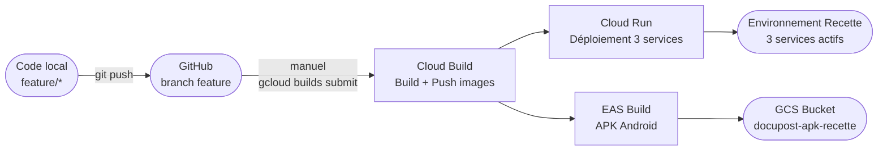

# Pipeline CI/CD DocuPost

> Version 1.1 — 2026-04-08
> Environnement cible : recette GCP (Cloud Run, europe-west1)
> Projet GCP : `docupost-recette-prod`

---

## Vue d'ensemble



> Le déclenchement est **manuel** pour l'environnement recette MVP.
> Pas de trigger GitHub configuré à ce stade.

---

## Commande de déploiement

Depuis la racine du projet, avec le projet GCP configuré :

```bash
TAG=$(git rev-parse --short HEAD)
gcloud builds submit \
  --config=cloudbuild.yaml \
  --substitutions=_TAG=${TAG} \
  --project=docupost-recette-prod
```

Durée typique : **8–12 minutes**

---

## Services couverts

| Service | Contexte source | Image Artifact Registry | Port Cloud Run |
|---------|----------------|------------------------|---------------|
| `svc-tournee` | `src/backend/svc-tournee` | `docupost/svc-tournee:$_TAG` | 8081 |
| `svc-supervision` | `src/backend/svc-supervision` | `docupost/svc-supervision:$_TAG` | 8082 |
| `frontend-supervision` | `src/web/supervision` | `docupost/frontend-supervision:$_TAG` | 80 |

## App mobile — distribution APK via EAS Build + GCS

L'app mobile (`src/mobile`) est une app **Expo ~51 (managed workflow)** — pas de Dockerfile, pas de Cloud Run.
Le build APK passe par **EAS Build** (Expo Application Services) qui gère la compilation Android dans le cloud Expo.

- **`build-mobile-apk`** — Cloud Build lance `eas build --profile preview --platform android --wait`. EAS compile l'APK sur ses serveurs Expo.
- **`upload-mobile-apk`** — Télécharge l'APK depuis EAS CDN et l'uploade dans le bucket GCS `docupost-apk-recette`.

**URLs de téléchargement APK :**

- Versionnée : `https://storage.googleapis.com/docupost-apk-recette/docupost-livreur-<TAG>.apk`
- Latest : `https://storage.googleapis.com/docupost-apk-recette/docupost-livreur-latest.apk`

### Prérequis une seule fois (infrastructure)

```bash
# 1. Créer le bucket GCS (accès public en lecture pour partage QR code)
gsutil mb -p docupost-recette-prod -l europe-west1 gs://docupost-apk-recette
gsutil iam ch allUsers:objectViewer gs://docupost-apk-recette

# 2. Stocker le token EAS dans Secret Manager
gcloud secrets create expo-token --data-file=- <<< "votre_token_EAS"
# ou
gcloud secrets versions add expo-token --data-file=- <<< "votre_token_EAS"

# 3. Donner accès au SA Cloud Build
SA="$(gcloud projects describe docupost-recette-prod --format='value(projectNumber)')@cloudbuild.gserviceaccount.com"
gcloud secrets add-iam-policy-binding expo-token \
  --member="serviceAccount:$SA" \
  --role="roles/secretmanager.secretAccessor"
gcloud projects add-iam-policy-binding docupost-recette-prod \
  --member="serviceAccount:$SA" \
  --role="roles/storage.objectAdmin"

# 4. Créer le projet EAS et lier au repo (une fois, en local)
cd src/mobile && eas project:init
```

### Obtenir un token EAS

```bash
npx eas-cli login          # se connecter
npx eas-cli whoami         # vérifier
# Générer un token sur https://expo.dev/accounts/<org>/settings/access-tokens
```

---

## Étapes du pipeline (`cloudbuild.yaml`)

```text
[1]  build-svc-tournee           docker build src/backend/svc-tournee → svc-tournee:$_TAG
[2]  push-svc-tournee            docker push → Artifact Registry
[3]  build-svc-supervision       docker build src/backend/svc-supervision → svc-supervision:$_TAG
[4]  push-svc-supervision        docker push → Artifact Registry
[5]  build-frontend-supervision  docker build src/web/supervision (avec REACT_APP_API_URL baked)
[6]  push-frontend-supervision   docker push → Artifact Registry
[7]  deploy-svc-tournee          gcloud run deploy (après [2])
[8]  deploy-svc-supervision      gcloud run deploy (après [4])
[9]  deploy-frontend-supervision gcloud run deploy (après [6])
[10] build-mobile-apk            eas build --platform android --profile preview --wait (EXPO_TOKEN)
[11] upload-mobile-apk           gsutil cp → gs://docupost-apk-recette/docupost-livreur-$_TAG.apk
```

Les étapes [7] et [8] s'exécutent en parallèle (elles ne dépendent pas l'une de l'autre).
Les étapes [10] et [11] sont indépendantes du déploiement web/back — elles ne bloquent pas [7]/[8]/[9].

---

## Substitutions Cloud Build

| Variable | Valeur par défaut | Description |
|----------|------------------|-------------|
| `_TAG` | `latest` | Tag image (remplacer par `$(git rev-parse --short HEAD)`) |
| `_SVC_SUPERVISION_URL` | URL Cloud Run supervision | Injectée comme REACT_APP_API_URL dans le frontend |
| `_SVC_TOURNEE_URL` | URL Cloud Run tournee | Injectée dans svc-supervision (DevEventBridge) |
| `_FRONTEND_URLS` | URLs Cloud Run + localhost | ALLOWED_ORIGINS CORS svc-supervision |
| `_AUTH_BYPASS` | `'true'` | Active MockJwtAuthFilter (recette uniquement) |
| `_APK_BUCKET` | `docupost-apk-recette` | Bucket GCS destination de l'APK mobile |

---

## Profils Spring Boot activés en recette

`SPRING_PROFILES_ACTIVE=prod,recette`

- `prod` : connexion Cloud SQL via socket factory, HikariCP 3 connexions, nginx
- `recette` : `MockJwtAuthFilter`, `DevTourneeController`, `DevDataSeeder`, `DevEventBridge`, `DevRestConfig`

---

## Dockerfiles

| Service | Base build | Base runtime | Notes |
|---------|-----------|--------------|-------|
| svc-tournee | `maven:3.9.6-eclipse-temurin-21` | `eclipse-temurin:21-jre-alpine` | `mvn dependency:go-offline` pour cache layer |
| svc-supervision | `maven:3.9.6-eclipse-temurin-21` | `eclipse-temurin:21-jre-alpine` | idem |
| frontend-supervision | `node:20-alpine` | `nginx:alpine` | `npm ci --legacy-peer-deps` (TS5 / react-scripts5 compat) |

---

## Prérequis pour déclencher un build

1. `gcloud` installé et authentifié : `gcloud auth login`
2. Projet configuré : `gcloud config set project docupost-recette-prod`
3. Cloud Build Service Account avec rôles : `cloudbuild.builds.builder`, `run.admin`, `cloudsql.client`
4. Artifact Registry repository `docupost` créé en `europe-west1`
5. Secrets Manager : `tournee-db-password`, `supervision-db-password`, `internal-secret`
6. Cloud SQL instance `docupost-db` en `europe-west1`
7. *(Mobile)* Secret `expo-token` dans Secret Manager + SA Cloud Build avec `secretmanager.secretAccessor` + `storage.objectAdmin` sur le bucket `docupost-apk-recette` (voir section "App mobile" ci-dessus)

---

## Historique des déploiements

| Date       | TAG        | Build ID Cloud Build                   | Déclencheur                   | Statut                           |
| ---------- | ---------- | -------------------------------------- | ----------------------------- | -------------------------------- |
| 2026-04-07 | initial    | —                                      | Manuel                        | SUCCESS                          |
| 2026-04-08 | —          | —                                      | Manuel (fix ALLOWED\_ORIGINS) | SUCCESS                          |
| 2026-04-22 | `0975f525` | `5a200cff-c686-43ce-9a44-2034730fca15` | Manuel gcloud builds submit   | **SUCCESS** — feature broadcast (US-067/068/069) |
| 2026-04-22 | `0975f525` | `753b5c5b-5209-44d7-aa6b-091a99840c33` | Manuel — fix SecurityConfig LIVREUR + eas.json URLs + cloudbuild no-wait | **SUCCESS** — backend + frontend ✓, APK EAS en queue (`f2f6d200`) |

### Vérification post-déploiement TAG 0975f525 — build 753b5c5b (2026-04-22)

| Service | Endpoint | Résultat |
|---------|----------|----------|
| svc-supervision | `/actuator/health` | `{"status":"UP"}` ✓ |
| `GET /broadcasts/recus?date=...` | LIVREUR | HTTP 200 ✓ (fix SecurityConfig) |

**Corrections appliquées dans ce build :**
- `SecurityConfig.java` : ajout explicite `LIVREUR` sur `GET /broadcasts/recus` et `POST /broadcasts/*/vu` (était bloqué par catch-all)
- `eas.json` : ajout `EXPO_PUBLIC_API_URL` et `EXPO_PUBLIC_SUPERVISION_URL` → URLs Cloud Run baked-in dans l'APK
- `cloudbuild.yaml` : EAS build en `--no-wait` → plus de timeout Cloud Build (2h dépassés par la queue Expo)
- `cloudbuild.yaml` : `timeout: 7200s` ajouté

**APK mobile** : EAS build `f2f6d200` en queue — upload vers GCS automatique à la fin.

---

## TODO — évolutions CI/CD

- [ ] Configurer un trigger GitHub sur `release/*` pour déclenchement automatique en recette
- [ ] Workload Identity Federation (remplacer les clés JSON SA)
- [ ] Pipeline staging : trigger sur `main`, tests smoke automatiques post-déploiement
- [ ] Pipeline prod : approbation manuelle obligatoire + blue/green
- [ ] Réparer `gcloud` en environnement shell agent (conflit module Python `google._upb._message`)
