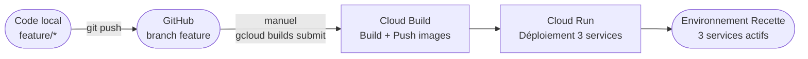

# Pipeline CI/CD DocuPost

> Version 1.1 — 2026-04-08
> Environnement cible : recette GCP (Cloud Run, europe-west1)
> Projet GCP : `docupost-recette-prod`

---

## Vue d'ensemble



> Le déclenchement est **manuel** pour l'environnement recette MVP.
> Pas de trigger GitHub configuré à ce stade.

---

## Commande de déploiement

Depuis la racine du projet, avec le projet GCP configuré :

```bash
TAG=$(git rev-parse --short HEAD)
gcloud builds submit \
  --config=cloudbuild.yaml \
  --substitutions=_TAG=${TAG} \
  --project=docupost-recette-prod
```

Durée typique : **8–12 minutes**

---

## Services couverts

| Service | Contexte source | Image Artifact Registry | Port Cloud Run |
|---------|----------------|------------------------|---------------|
| `svc-tournee` | `src/backend/svc-tournee` | `docupost/svc-tournee:$_TAG` | 8081 |
| `svc-supervision` | `src/backend/svc-supervision` | `docupost/svc-supervision:$_TAG` | 8082 |
| `frontend-supervision` | `src/web/supervision` | `docupost/frontend-supervision:$_TAG` | 80 |

> L'app mobile (`src/mobile`) est une app React Native native — elle n'est pas déployable sur Cloud Run.
> Son déploiement est un canal séparé (APK Android, distribution interne Docaposte).

---

## Étapes du pipeline (`cloudbuild.yaml`)

```
[1] build-svc-tournee           docker build src/backend/svc-tournee → svc-tournee:$_TAG
[2] push-svc-tournee            docker push → Artifact Registry
[3] build-svc-supervision       docker build src/backend/svc-supervision → svc-supervision:$_TAG
[4] push-svc-supervision        docker push → Artifact Registry
[5] build-frontend-supervision  docker build src/web/supervision (avec REACT_APP_API_URL baked)
[6] push-frontend-supervision   docker push → Artifact Registry
[7] deploy-svc-tournee          gcloud run deploy (après [2])
[8] deploy-svc-supervision      gcloud run deploy (après [4])
[9] deploy-frontend-supervision gcloud run deploy (après [6])
```

Les étapes [7] et [8] s'exécutent en parallèle (elles ne dépendent pas l'une de l'autre).

---

## Substitutions Cloud Build

| Variable | Valeur par défaut | Description |
|----------|------------------|-------------|
| `_TAG` | `latest` | Tag image (remplacer par `$(git rev-parse --short HEAD)`) |
| `_SVC_SUPERVISION_URL` | URL Cloud Run supervision | Injectée comme REACT_APP_API_URL dans le frontend |
| `_SVC_TOURNEE_URL` | URL Cloud Run tournee | Injectée dans svc-supervision (DevEventBridge) |
| `_FRONTEND_URLS` | URLs Cloud Run + localhost | ALLOWED_ORIGINS CORS svc-supervision |
| `_AUTH_BYPASS` | `'true'` | Active MockJwtAuthFilter (recette uniquement) |

---

## Profils Spring Boot activés en recette

`SPRING_PROFILES_ACTIVE=prod,recette`

- `prod` : connexion Cloud SQL via socket factory, HikariCP 3 connexions, nginx
- `recette` : `MockJwtAuthFilter`, `DevTourneeController`, `DevDataSeeder`, `DevEventBridge`, `DevRestConfig`

---

## Dockerfiles

| Service | Base build | Base runtime | Notes |
|---------|-----------|--------------|-------|
| svc-tournee | `maven:3.9.6-eclipse-temurin-21` | `eclipse-temurin:21-jre-alpine` | `mvn dependency:go-offline` pour cache layer |
| svc-supervision | `maven:3.9.6-eclipse-temurin-21` | `eclipse-temurin:21-jre-alpine` | idem |
| frontend-supervision | `node:20-alpine` | `nginx:alpine` | `npm ci --legacy-peer-deps` (TS5 / react-scripts5 compat) |

---

## Prérequis pour déclencher un build

1. `gcloud` installé et authentifié : `gcloud auth login`
2. Projet configuré : `gcloud config set project docupost-recette-prod`
3. Cloud Build Service Account avec rôles : `cloudbuild.builds.builder`, `run.admin`, `cloudsql.client`
4. Artifact Registry repository `docupost` créé en `europe-west1`
5. Secrets Manager : `tournee-db-password`, `supervision-db-password`, `internal-secret`
6. Cloud SQL instance `docupost-db` en `europe-west1`

---

## TODO — évolutions CI/CD

- [ ] Configurer un trigger GitHub sur `release/*` pour déclenchement automatique en recette
- [ ] Workload Identity Federation (remplacer les clés JSON SA)
- [ ] Pipeline staging : trigger sur `main`, tests smoke automatiques post-déploiement
- [ ] Pipeline prod : approbation manuelle obligatoire + blue/green
